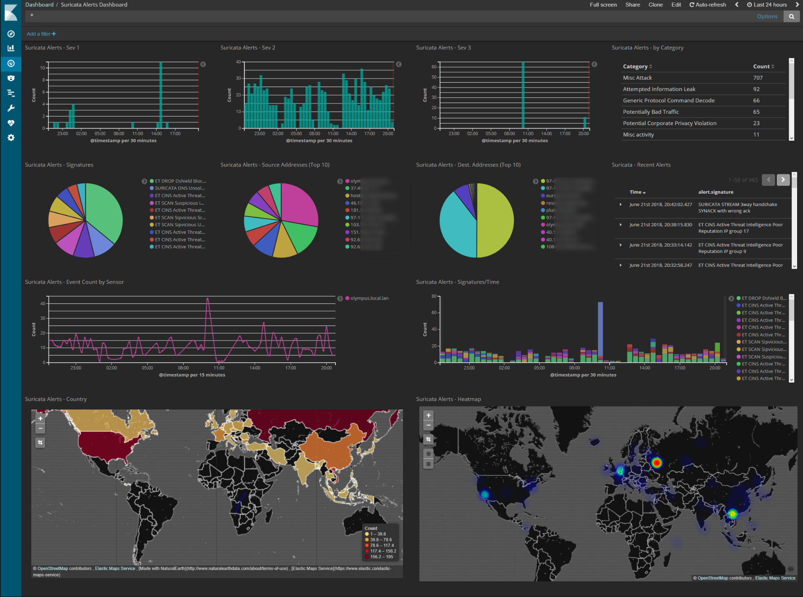

# router-idps-dashboard

Dockerized ELK dashboard for monitoring Suricata events from pfsense router.

This setup is based on the pfsense+filebeats -> ELK from this series of articles:  

https://extelligenceblog.it/2017/07/11/elastic-stack-suricata-idps-and-pfsense-firewall-part-1/

